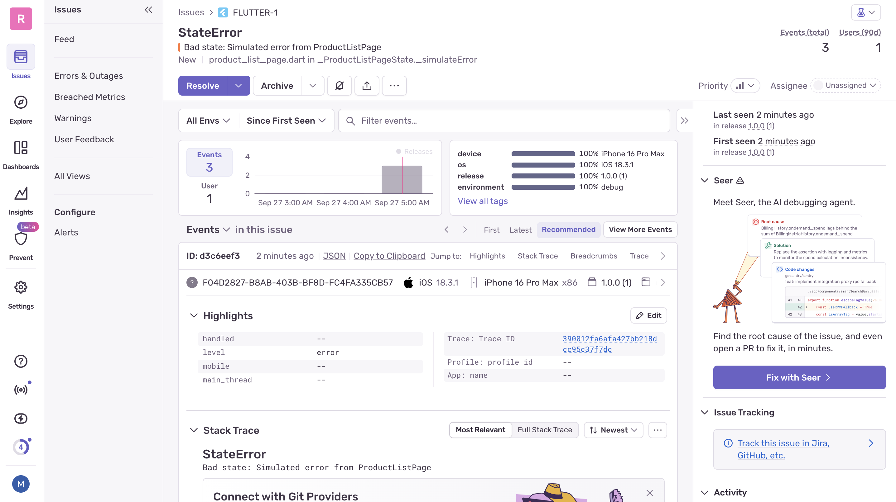

# Flutter Version
fvm 3.29.0

# Running App 
fvm flutter pub get
fvm flutter run \
  --dart-define=CRUDCRUD_BASE_URL=https://crudcrud.com/api/b4ba00a5f3554cab93e42d624c31cb91 \
  --dart-define=PRODUCTS_COLLECTION=products \
  --dart-define=SENTRY_DSN=https://059848a01c35562cd9af78f3a475a5fb@o4510089980739584.ingest.us.sentry.io/4510089982509056

# Run seeder for generate 20 product
- open seed_products.dart
- replace crudKey with your crudcrud key
- run 'dart run scripts/seed_products.dart'

# Test App
fvm flutter test

# Simulate Error with sentry_flutter
- Klik Button Simulate Error
- See error on Sentry Dashboard (https://sentry.io) like this:

